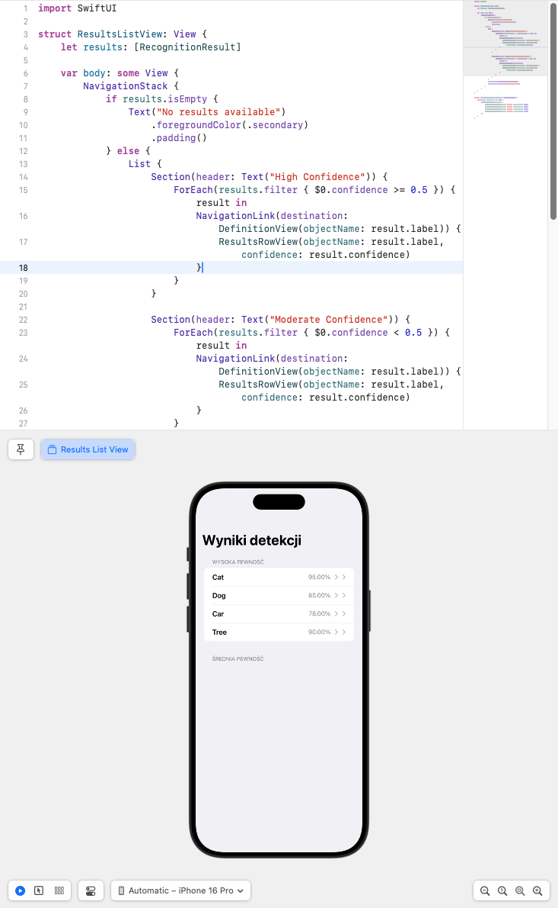

# Sprawozdanie z Laboratorium iOS

## Laboratorium 2: Interfejs użytkownika i zależności

### Wprowadzenie
Podczas laboratorium zaimplementowano aplikację na system iOS umożliwiającą rozpoznawanie obiektów na obrazie oraz wyświetlanie ich definicji. Zadanie obejmowało stworzenie podstawowych widoków, takich jak ekran ładowania obrazu, wyniki detekcji, ustawienia użytkownika oraz szczegóły wykrytego obiektu. W implementacji wykorzystano framework SwiftUI oraz bibliotekę `Alamofire`.

---

### 1. **Widok główny (ContentView)**
Widok główny został zrealizowany jako `TabView`, który umożliwia nawigację pomiędzy trzema zakładkami:
- **Load Image** – ekran do ładowania obrazu.
- **Results** – ekran wyświetlający wyniki detekcji.
- **Settings** – ekran ustawień użytkownika.

Każda zakładka posiada odpowiednią ikonę oraz tytuł. Stan aplikacji, w tym wyniki rozpoznawania, jest zarządzany przy użyciu właściwości `@State` oraz `@StateObject`.

---

### 2. **Widok ładowania obrazu (LoadImageView)**
Widok ładowania obrazu umożliwia użytkownikowi wybór obrazu z galerii za pomocą `PhotosPicker`. Po załadowaniu obraz jest wyświetlany, a przycisk "Run Recognition" inicjuje proces analizy z wykorzystaniem obiektu `ImageRecognizer`. W widoku uwzględniono:
- Obsługę różnych stanów aplikacji (np. brak obrazu, przetwarzanie, błąd) za pomocą `@State`.
- Pasek postępu widoczny podczas analizy obrazu.

---

### 3. **Widok wyników (ResultsListView)**
Wyniki rozpoznawania zostały zorganizowane w widoku listy w `NavigationStack`. Lista zawiera sekcje:
- **High Confidence** – wyniki z wysoką pewnością detekcji (>= 50%).
- **Moderate Confidence** – wyniki z niższą pewnością (< 50%).

Każdy element listy (`ResultsRowView`) przedstawia nazwę wykrytego obiektu oraz poziom pewności detekcji. Kliknięcie na element przenosi użytkownika do szczegółowego widoku definicji (`DefinitionView`).

---

### 4. **Widok definicji (DefinitionView)**
Widok prezentuje szczegółową definicję wykrytego obiektu pobraną z API słownika. Za pomocą `Alamofire` realizowane jest zapytanie HTTP do serwisu `https://api.dictionaryapi.dev`. Widok obsługuje różne stany, takie jak:
- Ładowanie definicji (`Loading...`),
- Wyświetlenie błędu w przypadku niepowodzenia,
- Wyświetlenie definicji obiektu, jeśli została poprawnie załadowana.

Mechanizm filtracji preferuje definicje rzeczowników, jeśli są dostępne.

---

### 5. **Widok ustawień (SettingsView)**
Widok ustawień umożliwia użytkownikowi wybór płci przy użyciu elementu `Picker` w stylu segmentowym. Dostępne opcje to: **Kobieta**, **Mężczyzna**, **Inna**. Wybrana opcja jest przechowywana w zmiennej `@State`.

---

### 6. **Struktura projektu**
Struktura aplikacji została zorganizowana w logiczne moduły:
- `ContentView.swift` – główny widok aplikacji.
- `Views/` – folder zawierający pliki poszczególnych widoków (`LoadImageView`, `ResultsListView`, `DefinitionView`, `SettingsView`).
- `Models/` – struktury modelowe używane w aplikacji.
- Dodatkowe zasoby, takie jak pliki lokalizacyjne i grafiki.

---

## Laboratorium 3: CoreML

### Wprowadzenie
Podczas tego laboratorium aplikacja została wzbogacona o funkcjonalność klasyfikacji obrazów przy użyciu modeli CoreML. Wprowadzono możliwość obsługi zarówno gotowych modeli, jak i samodzielnie wytrenowanych. Główne zadania obejmowały integrację modelu CoreML z aplikacją, przetwarzanie obrazów oraz wyświetlanie wyników klasyfikacji.

---

### 1. **Implementacja klasy ImageRecognizer**
Klasa `ImageRecognizer` jest odpowiedzialna za przetwarzanie obrazów przy użyciu modeli CoreML. Obsługuje różne stany aplikacji (`RecognitionState`), w tym przetwarzanie i obsługę błędów, oraz zwraca wyniki klasyfikacji w postaci tablicy `RecognitionResult`. 

Podczas inicjalizacji ładowany jest wybrany model w formacie `.mlmodelc` z katalogu zasobów aplikacji. Główne zadanie klasy `classifyImage` przetwarza obraz w formacie `UIImage` i wykorzystuje `VNCoreMLRequest` do wykonania predykcji.

---

### 2. **Integracja klasyfikacji obrazu w LoadImageView**
Widok `LoadImageView` pozwala użytkownikowi na wybór obrazu z galerii za pomocą `PhotosPicker`. Wybrany obraz jest wyświetlany w widoku, a przycisk "Run Recognition" inicjuje proces klasyfikacji.

Mechanizm przetwarzania obrazu:
- Po wyborze obrazu zmienia się stan aplikacji na `imageLoaded`.
- Kliknięcie przycisku wywołuje metodę `classifyImage` klasy `ImageRecognizer`.
- Wyniki klasyfikacji są zapisywane w zmiennej `recognitionResults` i wyświetlane w widoku wyników.

---

### 3. **Struktura modelu**
Modele używane w aplikacji zostały umieszczone w katalogu `Models/`, który zawiera:
- `ImageRecognizer.swift` – klasa obsługująca modele CoreML.
- `MobileNetV2.mlpackage` – skonwertowany model MobileNetV2 w formacie CoreML.
- `MyImageClassifier.mlmodel` – model wytrenowany w CreateML.
- `Result.swift` – struktura reprezentująca wynik klasyfikacji.

---

### 4. **Obsługa wyników klasyfikacji**
Każdy wynik klasyfikacji jest reprezentowany przez obiekt `RecognitionResult`, który przechowuje identyfikator, etykietę klasy oraz poziom pewności detekcji. Wyniki są prezentowane w widoku `ResultsListView`, gdzie dzielone są na sekcje według pewności predykcji.

---

